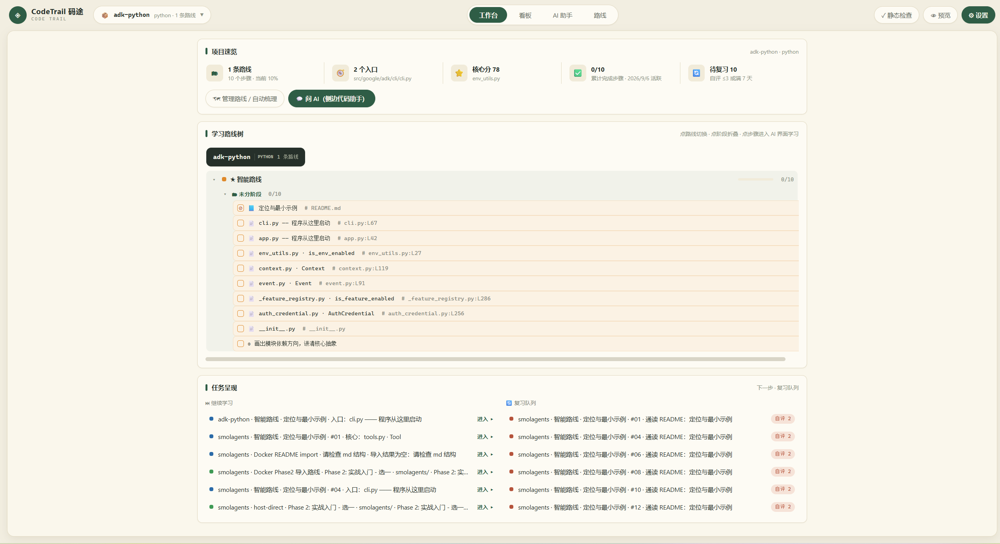
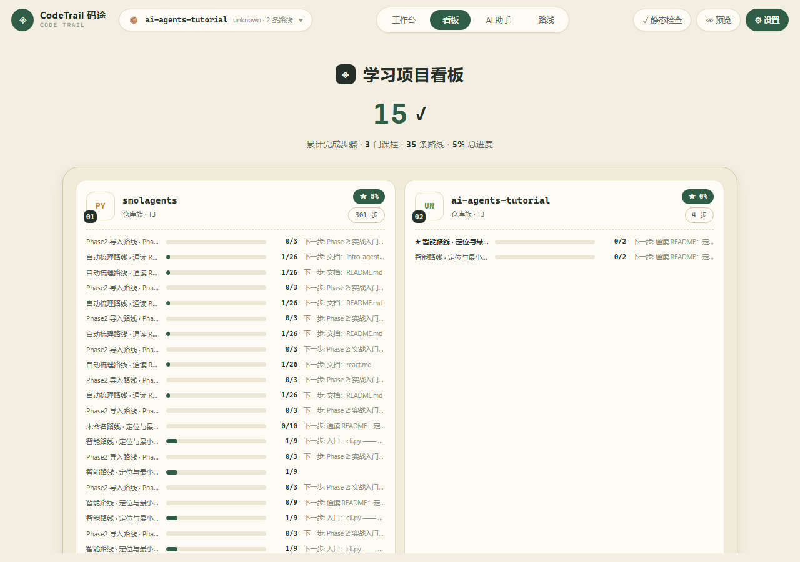
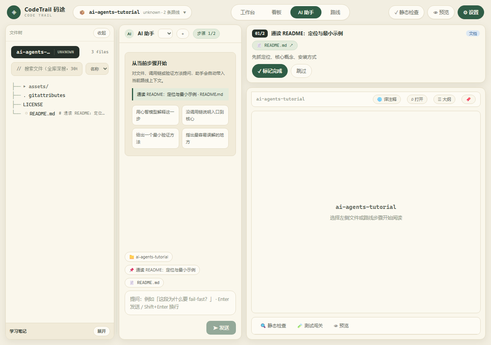
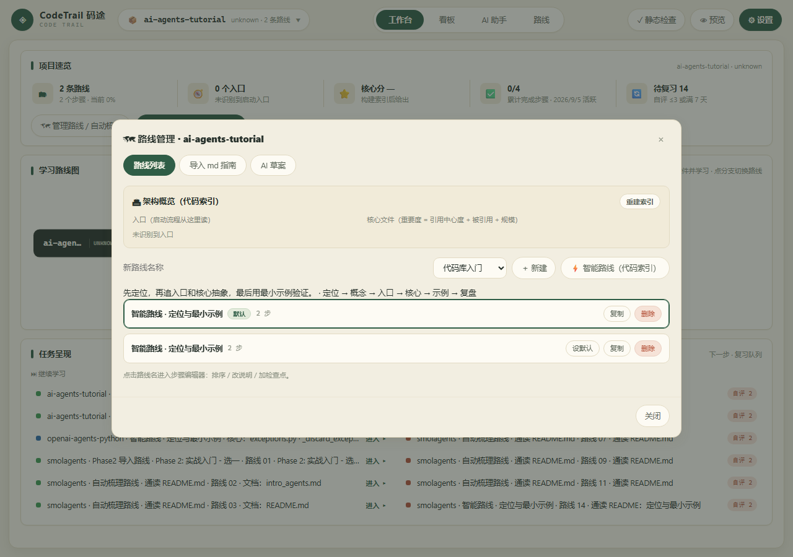
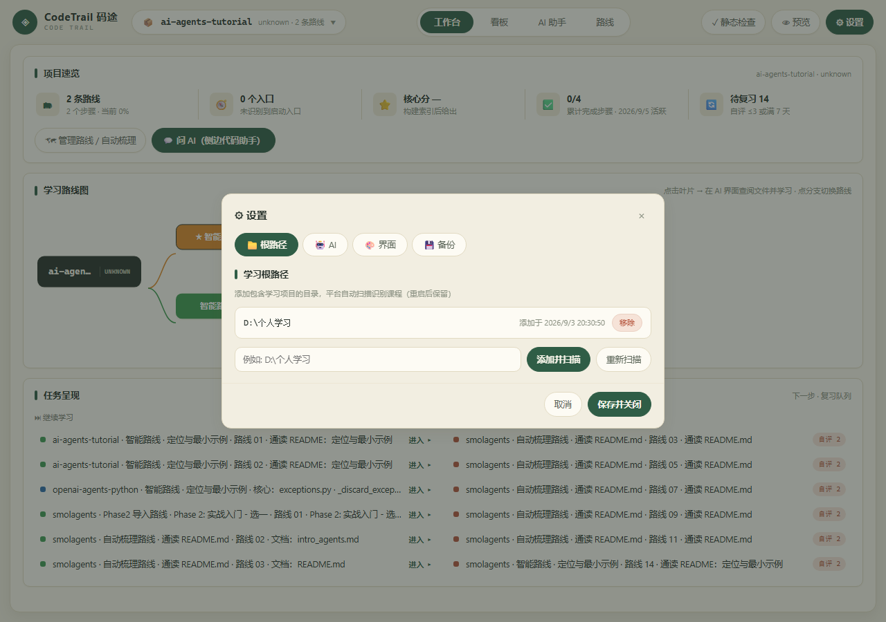
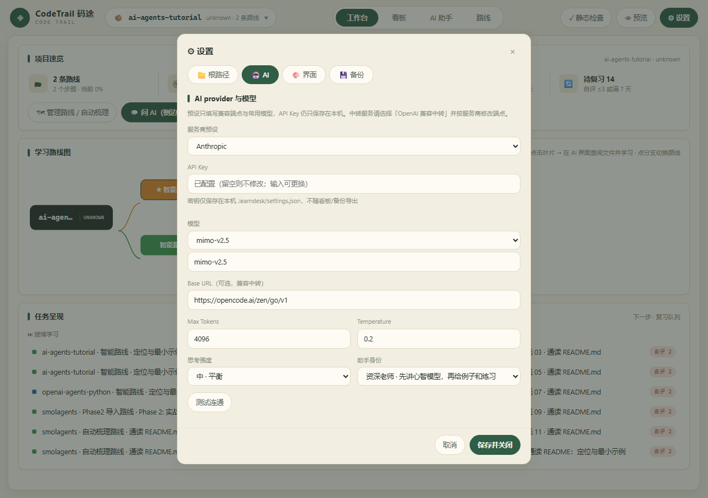

# CodeTrail 码途 — Local Code Learning Platform

> **🌐 Language: [中文](README.md) · [English](README.en.md) · [日本語](README.ja.md)**

> A code learning platform that runs in your local browser: pick any directory, it automatically scans learning
> projects, generates learning roadmaps, and lets you read code in a built-in IDE, ask an AI assistant, run tests,
> and track progress across multiple courses with a global dashboard. **All data stays on your machine, learning
> repos are read-only, and it is fully usable without an AI key.**


## Screenshots

| Workbench · Learning Roadmap | Dashboard · Cross-Course Summary | AI Assistant · Learning Workspace |
|---|---|---|
|  |  |  |
| **Route Modal · Smart Route / Import / AI Draft** | **Settings · Root Path & Theme** | **AI Settings** |
|  |  |  |

## Features

- **Auto-scan courses**: Register any learning directory — source repos / tutorial docs / examples are detected and classified into courses automatically
- **Code-index driven**: Symbol extraction (Python AST / JS·Go regex) → internal dependency graph → PageRank importance ranking → role classification (core / entry / example / doc / test), generated locally with zero tokens
- **Learning roadmaps**: Three sources — Smart Route (entry → core files with line ranges & reasons → examples), Markdown guide import, and AI drafts; step editor + file-existence validation
- **Built-in IDE reading area**: Monaco editor, three draggable panes, symbol outline, bookmarks (click the line-number gutter), large-file chunked reading, markdown preview / source toggle
- **AI assistant**: Multi-session chat that auto-carries course / step / file context; supports explanation, Q&A, route generation, and on-demand tutorial translation (non-code content only)
- **Test challenges & static checks**: M1 output comparison / M2 assertion scripts, sandboxed execution; py_compile / node --check / go vet; streaming logs over WebSocket
- **Progress & review**: State machine + 1–5 self-rating; low scores enter the review queue automatically, 7-day review reminders; dashboard + 30-day pixel heatmap
- **Five themes**: Cream (default) / Paper Green / Ink Night / Oatmeal Board / Paper Blue — all semantic tokens, zero hardcoded colors
- **Backup & migration**: One-click zip export (progress + routes + tests + notes, no AI key), automatic pre-import snapshot of the original database

## Quick Start

### Local launch (recommended)

Double-click `start.bat` (auto-detects node/uv/go → installs dependencies and builds the frontend on first run → single-port startup), then open <http://127.0.0.1:8787> in your browser.

### Manual

```bash
cd client && npm install && npm run build   # first run
cd ../server && npm install
npm run dev                                  # http://127.0.0.1:8787
```

### Docker (production)

```bash
docker compose up --build -d
docker compose ps                 # wait until codetrail is healthy
```

Open <http://127.0.0.1:8787>. Compose stores platform data in the `codetrail-ldd` named volume and mounts the parent learning directory read-only at `/workspace`; after first launch, add `/workspace` in Settings → Learning Root Path. The image contains no `.learndesk`, dependency cache, or API key — AI configuration lives only in that data volume.

### First use

1. Open the app → **Settings** → add a learning root path (e.g. `D:\Study`) → rescan
2. Pick a course from the course pill → **Routes** in the top bar → ⚡ Smart Route generates the roadmap
3. Click a leaf in the roadmap → AI view: the editor is already positioned at the file and line range → read code, ask AI, run tests, record progress

## Tech Stack

| Layer | Technology |
|---|---|
| Frontend | React 18 · TypeScript · Vite · Monaco Editor · react-markdown |
| Backend | Express · ws · node:sqlite (Node ≥ 22.5) · tsx |
| Code index | Custom (AST symbol extraction + dependency graph + PageRank) |
| Test execution | Python (uv) / Node / Go toolchains, sandboxed redirection |
| Container | Dockerfile + docker-compose (named-volume persistence) |

## Documentation

| Doc | Content |
|---|---|
| [docs/INTRO.md](docs/INTRO.md) | Project introduction — [English](docs/INTRO.en.md) / [日本語](docs/INTRO.ja.md) |
| [docs/FEATURES.md](docs/FEATURES.md) | Feature walkthrough (UI map / core mechanisms / FR traceability, Chinese) |
| [docs/API.md](docs/API.md) | Backend API reference (Chinese) |
| [DESIGN.md](DESIGN.md) | UI design contract — tokens / layout / states (Chinese) |

## Data & Security

- **Platform data directory (LDD)**: `<workspace root>\.learndesk\` (overridable via the `LEARNDESK_DIR` env var) —
  progress db.sqlite, settings.json (contains the AI key — never commit/sync it), routes/ / tests/ / notes/ / backups/ / tmp/.
  **Deleting this directory wipes all platform data.**
- **Learning repos are read-only**: the platform never writes into learner repos (test temp files / bytecode are redirected to LDD/tmp).
- The service binds only to `127.0.0.1:8787`; file access is whitelist-checked; exec processes have a 30s timeout and 200KB output truncation.
- The AI key is stored only in local settings.json, masked in API responses, and never exported with backups.

## Verification

```bash
cd server && npm install
node --import tsx --test test/*.test.ts   # backend unit/integration tests
cd ../client && npm install && npm run build   # frontend builds
```

## FAQ

- **Page opens but clicking does nothing**: usually the browser cached an old version — hard-refresh with `Ctrl+F5` once.
- **Red "Backend not connected" banner at the top**: the backend is not running. Run `start.bat` and refresh the page after it reports "Service ready".
- **Port 8787 is occupied**: another instance is already running — just open <http://127.0.0.1:8787>.
- **Files won't open / scan is empty**: check the root path setting (Settings → Root Path → rescan).

## License

MIT License (replace with your LICENSE file as needed).